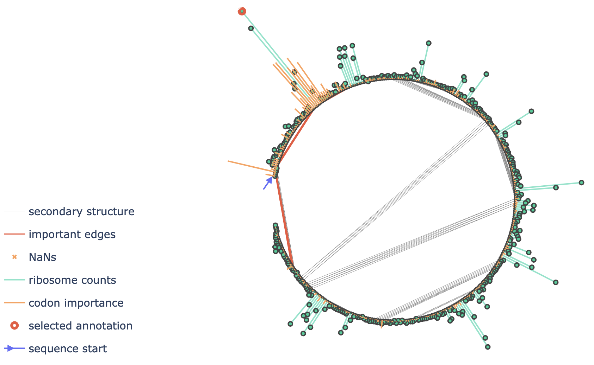

# RiboGL
Repository of "Towards improving full-length ribosome density prediction by bridging sequence and graph-based representations".

## RiboGL Model

## Plotly Server


Inside the `interpret` subfolder one can find the code to run the Plotly server to intepret the RiboGL predictions.

In order to run the server:
1. Install the dependecies in a conda envirorment `ribogl` (arbitrary name):
    ```bash
    conda env create -n ribogl -f interpret/requirements.yaml
    ```
2. Download the data into the `data` subfolder.
3. Run the server:
    ```bash
    conda activate ribogl
    python interpret/app.py --port 8050
    ```
    The server will be available at http://localhost:8050/. The port can be changed with the `port` argument.
